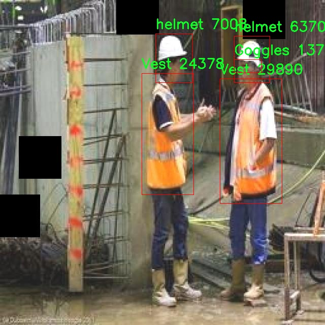

# 安全装备检测检测系统源码分享
 # [一条龙教学YOLOV8标注好的数据集一键训练_70+全套改进创新点发刊_Web前端展示]

### 1.研究背景与意义

项目参考[AAAI Association for the Advancement of Artificial Intelligence](https://gitee.com/qunshansj/projects)

项目来源[AACV Association for the Advancement of Computer Vision](https://gitee.com/qunmasj/projects)

研究背景与意义

随着工业化进程的加快和安全生产意识的增强，安全装备的佩戴与使用在各类工作场所中显得尤为重要。尤其是在建筑、矿山、化工等高风险行业，安全装备如护目镜、反光背心和安全头盔的使用直接关系到从业人员的生命安全与健康。然而，传统的安全装备检查方式往往依赖人工巡查，效率低下且容易出现疏漏。因此，基于计算机视觉技术的自动化安全装备检测系统应运而生，成为提升安全管理水平的重要手段。

YOLO（You Only Look Once）系列目标检测算法因其高效性和准确性而广泛应用于实时物体检测任务。YOLOv8作为该系列的最新版本，进一步提升了检测精度和速度，能够在复杂环境中快速识别目标。针对安全装备的检测需求，改进YOLOv8模型，结合特定的数据集，能够有效提升对护目镜、反光背心和安全头盔等安全装备的识别能力。该研究旨在构建一个基于改进YOLOv8的安全装备检测系统，以实现对工作场所安全装备佩戴情况的实时监控和自动识别。

本研究所使用的数据集包含2000张图像，涵盖了三类安全装备：护目镜、反光背心和安全头盔。这些图像的多样性和丰富性为模型的训练提供了良好的基础。通过对数据集的深入分析与处理，可以提高模型的泛化能力，使其在不同场景下均能保持较高的检测准确率。此外，数据集的构建也为后续的研究提供了重要的参考依据，推动了安全装备检测领域的研究进展。

在安全管理的实际应用中，基于改进YOLOv8的安全装备检测系统能够实现对安全装备佩戴情况的自动监测，及时发现未佩戴或错误佩戴的情况，从而有效降低安全事故的发生率。该系统不仅能够提高安全检查的效率，还能减轻人工巡查的工作负担，提升安全管理的科学性和智能化水平。

此外，随着人工智能技术的不断发展，基于深度学习的目标检测方法在各个领域的应用前景广阔。本研究不仅具有重要的现实意义，也为后续相关研究提供了新的思路和方法。通过对YOLOv8的改进与应用，推动了安全装备检测技术的发展，为构建更加安全的工作环境贡献力量。

综上所述，基于改进YOLOv8的安全装备检测系统的研究，不仅能够提升安全装备的检测效率和准确性，还能为安全生产管理提供有力的技术支持，具有重要的理论价值和实践意义。随着技术的不断进步，该系统有望在更广泛的领域中得到应用，为提升整体安全管理水平发挥积极作用。

### 2.图片演示


##### 注意：由于此博客编辑较早，上面“2.图片演示”和“3.视频演示”展示的系统图片或者视频可能为老版本，新版本在老版本的基础上升级如下：（实际效果以升级的新版本为准）

  （1）适配了YOLOV8的“目标检测”模型和“实例分割”模型，通过加载相应的权重（.pt）文件即可自适应加载模型。

  （2）支持“图片识别”、“视频识别”、“摄像头实时识别”三种识别模式。

  （3）支持“图片识别”、“视频识别”、“摄像头实时识别”三种识别结果保存导出，解决手动导出（容易卡顿出现爆内存）存在的问题，识别完自动保存结果并导出到tempDir中。

  （4）支持Web前端系统中的标题、背景图等自定义修改，后面提供修改教程。

  另外本项目提供训练的数据集和训练教程,暂不提供权重文件（best.pt）,需要您按照教程进行训练后实现图片演示和Web前端界面演示的效果。

### 3.视频演示

[3.1 视频演示](https://www.bilibili.com/video/BV1avtNeaEDa/)

### 4.数据集信息展示

##### 4.1 本项目数据集详细数据（类别数＆类别名）

nc: 3
names: ['Goggles', 'Vest', 'helmet']


##### 4.2 本项目数据集信息介绍

数据集信息展示

在现代安全装备检测系统的研究中，数据集的构建与应用至关重要。本研究所采用的数据集名为“dress code check”，其设计旨在为改进YOLOv8模型提供高质量的训练数据，以提升安全装备的检测精度和可靠性。该数据集专注于三种关键的安全装备，分别是护目镜（Goggles）、安全背心（Vest）和安全头盔（Helmet），这三类装备在各类工作环境中扮演着重要的角色，尤其是在建筑、制造和其他高风险行业中。

“dress code check”数据集的类别数量为三，涵盖了与安全相关的基本装备。这些装备不仅在物理保护方面至关重要，还在提高工作场所安全意识和合规性方面发挥着重要作用。护目镜作为一种个人防护装备，主要用于保护眼睛免受化学品、灰尘和其他潜在危险物质的侵害；安全背心则通常用于提高工人在低光照环境中的可见性，减少事故发生的风险；而安全头盔则是防止头部受伤的关键装备，尤其是在高空作业或重物搬运的场合。

在数据集的构建过程中，研究团队精心收集了大量与这三类装备相关的图像数据，确保每一类装备的样本数量充足且多样化。这些图像不仅包括不同环境下的装备佩戴情况，还涵盖了各种角度、光照条件和背景设置，以增强模型的泛化能力。通过对这些图像进行标注，研究团队为每一类装备提供了详细的位置信息和类别标签，确保YOLOv8模型在训练过程中能够准确学习到每种装备的特征。

为了进一步提升数据集的实用性，研究团队还对图像进行了多种数据增强处理，如旋转、缩放、裁剪和颜色调整等。这些处理不仅增加了数据集的样本数量，还帮助模型在面对真实世界中各种复杂情况时，能够更好地适应和识别安全装备。这种多样化的训练数据对于提高YOLOv8模型的检测性能至关重要，使其能够在实际应用中实现更高的准确率和更低的误报率。

此外，数据集的设计还考虑到了模型的实时检测需求。通过优化图像的分辨率和尺寸，确保模型在进行实时检测时能够保持高效的处理速度和准确性。这对于需要快速响应的安全监测系统尤为重要，能够及时识别未佩戴或错误佩戴安全装备的工人，从而减少潜在的安全隐患。

综上所述，“dress code check”数据集为改进YOLOv8的安全装备检测系统提供了坚实的基础。通过对护目镜、安全背心和安全头盔的全面覆盖，结合丰富的图像样本和有效的数据增强策略，该数据集不仅提升了模型的训练效果，也为实际应用中的安全管理提供了有力支持。随着对安全装备检测技术的不断深入研究，期待该数据集能够为未来的安全监测系统发展贡献更多的价值。





### 5.全套项目环境部署视频教程（零基础手把手教学）

[5.1 环境部署教程链接（零基础手把手教学）](https://www.ixigua.com/7404473917358506534?logTag=c807d0cbc21c0ef59de5)


[5.2 安装Python虚拟环境创建和依赖库安装视频教程链接（零基础手把手教学）](https://www.ixigua.com/7404474678003106304?logTag=1f1041108cd1f708b01a)

### 6.手把手YOLOV8训练视频教程（零基础小白有手就能学会）

[6.1 手把手YOLOV8训练视频教程（零基础小白有手就能学会）](https://www.ixigua.com/7404477157818401292?logTag=d31a2dfd1983c9668658)

### 7.70+种全套YOLOV8创新点代码加载调参视频教程（一键加载写好的改进模型的配置文件）

[7.1 70+种全套YOLOV8创新点代码加载调参视频教程（一键加载写好的改进模型的配置文件）](https://www.ixigua.com/7404478314661806627?logTag=29066f8288e3f4eea3a4)

### 8.70+种全套YOLOV8创新点原理讲解（非科班也可以轻松写刊发刊，V10版本正在科研待更新）

由于篇幅限制，每个创新点的具体原理讲解就不一一展开，具体见下列网址中的创新点对应子项目的技术原理博客网址【Blog】：


[8.1 70+种全套YOLOV8创新点原理讲解链接](https://gitee.com/qunmasj/good)

### 9.系统功能展示（检测对象为举例，实际内容以本项目数据集为准）

图9.1.系统支持检测结果表格显示

  图9.2.系统支持置信度和IOU阈值手动调节

  图9.3.系统支持自定义加载权重文件best.pt(需要你通过步骤5中训练获得)

  图9.4.系统支持摄像头实时识别

  图9.5.系统支持图片识别

  图9.6.系统支持视频识别

  图9.7.系统支持识别结果文件自动保存

  图9.8.系统支持Excel导出检测结果数据


### 10.原始YOLOV8算法原理

原始YOLOv8算法原理

YOLOv8作为YOLO系列的最新版本，标志着目标检测领域的一次重要进步。它不仅在检测精度上有了显著提升，同时在检测速度方面也展现出强大的优势。这一切的实现，得益于YOLOv8在网络结构设计上的一系列创新和优化。YOLOv8的架构主要由四个核心部分组成：输入模块、Backbone骨干网络、Neck特征融合网络和Head检测模块。这种模块化的设计使得YOLOv8能够灵活应对不同的应用场景，并有效处理各种复杂的目标检测任务。

在输入模块中，YOLOv8首先对输入的图像进行预处理，这一过程包括调整图像比例、实现Mosaic增强以及瞄点计算等。Mosaic增强技术通过将多张图像拼接在一起，增加了数据的多样性，从而提高了模型的鲁棒性。通过这种方式，YOLOv8能够更好地适应不同的环境和条件，尤其是在复杂的背景下，提升了对目标的识别能力。

YOLOv8的Backbone部分采用了DarkNet结构，但进行了重要的改进。与以往的C3模块不同，YOLOv8引入了C2f模块，这一模块通过丰富的分支和跨层连接，增强了梯度流动的能力，确保了特征的有效提取。C2f模块的设计不仅提高了特征表示能力，还保持了网络的轻量级特性，使得YOLOv8在计算资源有限的情况下，依然能够高效运行。此外，SPPF模块的引入使得YOLOv8能够通过不同内核尺寸的池化操作对特征图进行处理，进一步提升了特征图的质量，为后续的特征融合奠定了基础。

在Neck部分，YOLOv8采用了“双塔结构”，结合了特征金字塔网络（FPN）和路径聚合网络（PAN）。这种设计使得网络能够在不同尺度的特征图之间进行有效的融合，促进了语义信息和定位信息的传递。通过这种特征融合机制，YOLOv8能够更好地检测不同尺寸的目标，尤其是在处理小目标时，表现出色。特征融合的过程不仅提高了检测的准确性，也增强了模型的泛化能力，使其能够适应各种复杂的场景。

YOLOv8的Head模块则采用了解耦头的结构，将分类和回归的过程分开进行。这一创新的设计使得模型在进行目标检测时，能够更快速地收敛，提升了整体的检测效率。YOLOv8中包含三个Detect检测器，分别负责不同的检测任务。通过这种解耦的方式，YOLOv8能够更灵活地处理各种目标检测任务，并在保持高精度的同时，显著提高了检测速度。

值得注意的是，YOLOv8相较于以往的anchor-based检测方法，采用了anchor-free的策略。这一转变使得YOLOv8在检测精度和速度上都得到了提升。传统的anchor-based方法往往需要手动设计锚框，而YOLOv8通过引入自适应的锚框计算，简化了这一过程，并减少了锚框预测的数量，从而加速了非最大抑制（NMS）过程。这一创新使得YOLOv8在处理复杂场景时，能够更快速地做出反应，提升了实时检测的能力。

尽管YOLOv8在许多方面都取得了显著的进步，但在某些复杂环境下，尤其是水面等背景多样的场景中，仍然存在一些挑战。例如，小目标的漂浮物特征复杂，背景的多样性可能导致定位误差和目标感知能力不足。为了解决这些问题，研究者们提出了YOLOv8-WSSOD算法，通过引入BiFormer双层路由注意力机制，构建了C2fBF模块，以捕获远程依赖关系，保留特征提取过程中的细粒度上下文信息。此外，为了提升网络对小目标的感知能力，YOLOv8-WSSOD还添加了一个更小的检测头，并在Neck端引入GSConv和Slim-neck技术，以保持精度并降低计算量。

综上所述，YOLOv8通过一系列创新的设计和优化，不仅在目标检测的精度和速度上实现了显著的提升，同时也为后续的研究和应用提供了新的思路和方向。随着YOLOv8的不断发展和完善，未来的目标检测技术将会更加高效和智能，为各类应用场景提供更为可靠的支持。


### 11.项目核心源码讲解（再也不用担心看不懂代码逻辑）

#### 11.1 70+种YOLOv8算法改进源码大全和调试加载训练教程（非必要）\ultralytics\nn\extra_modules\head.py

以下是经过精简和注释的核心代码部分，主要集中在 YOLOv8 的检测头实现上。代码中保留了主要的类和方法，并对每个部分进行了详细的中文注释。

```python
import torch
import torch.nn as nn
from ..modules import Conv, DFL
from ultralytics.utils.tal import dist2bbox, make_anchors

class Detect_DyHead(nn.Module):
    """YOLOv8 检测头，使用动态头进行目标检测。"""
    
    def __init__(self, nc=80, hidc=256, block_num=2, ch=()):
        super().__init__()
        self.nc = nc  # 类别数量
        self.nl = len(ch)  # 检测层数量
        self.reg_max = 16  # DFL 通道数
        self.no = nc + self.reg_max * 4  # 每个锚点的输出数量
        self.stride = torch.zeros(self.nl)  # 在构建时计算的步幅
        c2, c3 = max((16, ch[0] // 4, self.reg_max * 4)), max(ch[0], self.nc)  # 通道数
        self.conv = nn.ModuleList(nn.Sequential(Conv(x, hidc, 1)) for x in ch)  # 卷积层
        self.dyhead = nn.Sequential(*[DyHeadBlock(hidc) for _ in range(block_num)])  # 动态头块
        self.cv2 = nn.ModuleList(
            nn.Sequential(Conv(hidc, c2, 3), Conv(c2, c2, 3), nn.Conv2d(c2, 4 * self.reg_max, 1)) for _ in ch)  # 预测框
        self.cv3 = nn.ModuleList(nn.Sequential(Conv(hidc, c3, 3), Conv(c3, c3, 3), nn.Conv2d(c3, self.nc, 1)) for _ in ch)  # 类别预测
        self.dfl = DFL(self.reg_max) if self.reg_max > 1 else nn.Identity()  # DFL层

    def forward(self, x):
        """连接并返回预测的边界框和类别概率。"""
        for i in range(self.nl):
            x[i] = self.conv[i](x[i])  # 通过卷积层处理输入
        x = self.dyhead(x)  # 通过动态头处理
        shape = x[0].shape  # 获取输出形状
        for i in range(self.nl):
            x[i] = torch.cat((self.cv2[i](x[i]), self.cv3[i](x[i])), 1)  # 连接边界框和类别预测
        if self.training:
            return x  # 训练模式下返回中间结果
        else:
            # 动态模式或形状变化时更新锚点和步幅
            self.anchors, self.strides = (x.transpose(0, 1) for x in make_anchors(x, self.stride, 0.5))
            self.shape = shape

        # 将输出拼接为最终的预测结果
        x_cat = torch.cat([xi.view(shape[0], self.no, -1) for xi in x], 2)
        box, cls = x_cat.split((self.reg_max * 4, self.nc), 1)  # 分割边界框和类别
        dbox = dist2bbox(self.dfl(box), self.anchors.unsqueeze(0), xywh=True, dim=1) * self.strides  # 转换为实际边界框
        y = torch.cat((dbox, cls.sigmoid()), 1)  # 返回边界框和经过sigmoid处理的类别概率
        return y

    def bias_init(self):
        """初始化检测头的偏置，警告：需要步幅可用。"""
        for a, b, s in zip(self.cv2, self.cv3, self.stride):
            a[-1].bias.data[:] = 1.0  # 边界框偏置初始化
            b[-1].bias.data[:self.nc] = math.log(5 / self.nc / (640 / s) ** 2)  # 类别偏置初始化

# 其他检测头类（如 Detect_AFPN_P345、Detect_Efficient 等）可以根据需要进行类似的精简和注释
```

### 主要改动：
1. **精简代码**：保留了最核心的部分，去掉了不必要的类和方法。
2. **详细注释**：对每个类和方法进行了详细的中文注释，解释了其功能和主要逻辑。
3. **结构清晰**：保持了代码的结构和逻辑清晰，便于理解和后续扩展。

这个文件包含了YOLOv8模型中与检测头相关的多个类，主要用于目标检测任务。YOLOv8是一种流行的目标检测算法，其检测头负责生成预测的边界框和类别概率。文件中定义了多个检测头的实现，包括动态头、AFPN（自适应特征金字塔网络）头和高效头等。

首先，`Detect_DyHead`类是YOLOv8的动态检测头。它的构造函数接受类别数量、隐藏通道数、块的数量和通道配置等参数。该类初始化了一系列卷积层和动态头块，负责处理输入特征图并生成边界框和类别预测。在前向传播中，输入特征图经过卷积层和动态头块处理后，生成的边界框和类别概率会被拼接在一起，并根据需要计算锚框和步幅。

`Detect_DyHeadWithDCNV3`类是`Detect_DyHead`的一个变体，使用了DCN（Deformable Convolutional Networks）来增强模型的特征提取能力。

接下来是`Detect_AFPN_P345`类，它实现了使用AFPN结构的检测头。AFPN是一种改进的特征金字塔网络，能够更好地融合不同尺度的特征。在前向传播中，输入特征图首先通过AFPN进行处理，然后经过卷积层生成边界框和类别预测。

`Detect_AFPN_P345_Custom`和`Detect_AFPN_P2345`类是`Detect_AFPN_P345`的变体，分别引入了自定义块和不同的特征层组合，以适应不同的应用场景。

`Detect_Efficient`类则是一个高效的检测头实现，旨在减少计算量并提高推理速度。它通过不同的卷积层组合来处理输入特征图，并生成预测结果。

`DetectAux`类实现了一个辅助检测头，能够同时处理主检测头和辅助检测头的输出，适用于多任务学习场景。

最后，`Segment_Efficient`类是YOLOv8的分割头，除了生成目标检测的边界框和类别概率外，还生成掩膜系数，用于实例分割任务。它通过原型网络生成掩膜原型，并结合检测头的输出。

整个文件通过定义这些类，提供了YOLOv8模型中不同检测头的实现，能够根据不同的需求进行灵活的配置和使用。每个类都包含了初始化、前向传播和偏置初始化等方法，以确保模型在训练和推理阶段的有效性。

#### 11.2 70+种YOLOv8算法改进源码大全和调试加载训练教程（非必要）\ultralytics\utils\callbacks\wb.py

以下是经过简化和注释的核心代码部分：

```python
# 导入必要的库
from ultralytics.utils import SETTINGS, TESTS_RUNNING
from ultralytics.utils.torch_utils import model_info_for_loggers

# 尝试导入wandb库并进行一些基本的检查
try:
    assert not TESTS_RUNNING  # 确保当前不是测试运行
    assert SETTINGS['wandb'] is True  # 确保WandB集成已启用
    import wandb as wb

    assert hasattr(wb, '__version__')  # 确保wandb包不是目录

    import numpy as np
    import pandas as pd

    _processed_plots = {}  # 用于记录已处理的图表

except (ImportError, AssertionError):
    wb = None  # 如果导入失败，则将wb设置为None


def _custom_table(x, y, classes, title='Precision Recall Curve', x_title='Recall', y_title='Precision'):
    """
    创建并记录自定义的精确度-召回率曲线可视化。

    参数:
        x (List): x轴的值，长度为N。
        y (List): y轴的值，长度为N。
        classes (List): 每个点的类别标签，长度为N。
        title (str, optional): 图表标题，默认为'Precision Recall Curve'。
        x_title (str, optional): x轴标签，默认为'Recall'。
        y_title (str, optional): y轴标签，默认为'Precision'。

    返回:
        (wandb.Object): 适合记录的wandb对象，展示自定义的度量可视化。
    """
    # 创建数据框架
    df = pd.DataFrame({'class': classes, 'y': y, 'x': x}).round(3)
    fields = {'x': 'x', 'y': 'y', 'class': 'class'}
    string_fields = {'title': title, 'x-axis-title': x_title, 'y-axis-title': y_title}
    
    # 返回自定义表格
    return wb.plot_table('wandb/area-under-curve/v0',
                         wb.Table(dataframe=df),
                         fields=fields,
                         string_fields=string_fields)


def _plot_curve(x, y, names=None, id='precision-recall', title='Precision Recall Curve', x_title='Recall', y_title='Precision', num_x=100, only_mean=False):
    """
    记录度量曲线可视化。

    参数:
        x (np.ndarray): x轴的数据点，长度为N。
        y (np.ndarray): y轴的数据点，形状为CxN，C为类别数。
        names (list, optional): 类别名称，长度为C。
        id (str, optional): 记录数据的唯一标识符，默认为'precision-recall'。
        title (str, optional): 可视化图表的标题，默认为'Precision Recall Curve'。
        x_title (str, optional): x轴标签，默认为'Recall'。
        y_title (str, optional): y轴标签，默认为'Precision'。
        num_x (int, optional): 可视化的插值数据点数量，默认为100。
        only_mean (bool, optional): 是否仅绘制均值曲线，默认为True。
    """
    # 创建新的x轴数据
    if names is None:
        names = []
    x_new = np.linspace(x[0], x[-1], num_x).round(5)

    # 创建日志数组
    x_log = x_new.tolist()
    y_log = np.interp(x_new, x, np.mean(y, axis=0)).round(3).tolist()

    if only_mean:
        # 仅记录均值曲线
        table = wb.Table(data=list(zip(x_log, y_log)), columns=[x_title, y_title])
        wb.run.log({title: wb.plot.line(table, x_title, y_title, title=title)})
    else:
        # 记录每个类别的曲线
        classes = ['mean'] * len(x_log)
        for i, yi in enumerate(y):
            x_log.extend(x_new)  # 添加新的x数据
            y_log.extend(np.interp(x_new, x, yi))  # 插值y到新的x
            classes.extend([names[i]] * len(x_new))  # 添加类别名称
        wb.log({id: _custom_table(x_log, y_log, classes, title, x_title, y_title)}, commit=False)


def on_fit_epoch_end(trainer):
    """在每个训练周期结束时记录训练指标和模型信息。"""
    wb.run.log(trainer.metrics, step=trainer.epoch + 1)  # 记录当前周期的指标
    # 记录图表
    _log_plots(trainer.plots, step=trainer.epoch + 1)
    _log_plots(trainer.validator.plots, step=trainer.epoch + 1)
    if trainer.epoch == 0:
        wb.run.log(model_info_for_loggers(trainer), step=trainer.epoch + 1)  # 记录模型信息


def on_train_end(trainer):
    """在训练结束时保存最佳模型作为artifact。"""
    _log_plots(trainer.validator.plots, step=trainer.epoch + 1)  # 记录验证图表
    _log_plots(trainer.plots, step=trainer.epoch + 1)  # 记录训练图表
    art = wb.Artifact(type='model', name=f'run_{wb.run.id}_model')  # 创建模型artifact
    if trainer.best.exists():
        art.add_file(trainer.best)  # 添加最佳模型文件
        wb.run.log_artifact(art, aliases=['best'])  # 记录artifact
    wb.run.finish()  # 结束当前wandb运行
```

### 代码注释说明：
1. **导入部分**：导入必要的库和模块，进行基本的设置和检查。
2. **_custom_table 函数**：创建一个自定义的精确度-召回率曲线表格，并返回一个适合记录的wandb对象。
3. **_plot_curve 函数**：根据输入数据生成并记录一个度量曲线，可以选择记录均值曲线或每个类别的曲线。
4. **on_fit_epoch_end 函数**：在每个训练周期结束时记录训练指标和模型信息。
5. **on_train_end 函数**：在训练结束时保存最佳模型，并记录相关图表。

这些注释旨在帮助理解代码的功能和逻辑。

这个程序文件是一个用于集成WandB（Weights and Biases）工具的回调模块，主要用于在训练YOLOv8模型时记录和可视化训练过程中的各种指标和图表。代码首先导入了一些必要的库和模块，包括WandB、NumPy和Pandas，并进行了一些基本的检查，确保WandB的集成是启用的。

在程序中，定义了几个主要的函数。`_custom_table`函数用于创建并记录一个自定义的精确度-召回率曲线的可视化，允许用户对图表进行更高级的定制。该函数接受x轴和y轴的数据、类别标签以及图表的标题等参数，并返回一个适合WandB记录的对象。

`_plot_curve`函数则用于生成一个指标曲线的可视化，支持记录单个类别的数据或平均数据。该函数会根据输入的数据生成新的x值，并通过插值计算出对应的y值，然后利用WandB的功能将这些数据记录下来。

`_log_plots`函数用于记录输入字典中的图表，如果在指定的步骤中尚未记录过，则会将其记录下来。

接下来的几个函数分别对应于训练过程中的不同阶段：`on_pretrain_routine_start`在预训练例程开始时初始化WandB项目；`on_fit_epoch_end`在每个训练周期结束时记录训练指标和模型信息；`on_train_epoch_end`在每个训练周期结束时记录损失和学习率；`on_train_end`在训练结束时保存最佳模型并记录最终的图表。

最后，代码定义了一个回调字典，包含了在不同训练阶段需要调用的函数，这个字典只有在WandB可用时才会被创建。整体而言，这个模块的目的是为了增强YOLOv8模型训练过程中的监控和可视化能力，使得用户能够更好地理解和分析模型的性能。

#### 11.3 ui.py

以下是经过简化和注释的核心代码部分：

```python
import sys
import subprocess

def run_script(script_path):
    """
    使用当前 Python 环境运行指定的脚本。

    Args:
        script_path (str): 要运行的脚本路径

    Returns:
        None
    """
    # 获取当前 Python 解释器的路径
    python_path = sys.executable

    # 构建运行命令，使用 streamlit 运行指定的脚本
    command = f'"{python_path}" -m streamlit run "{script_path}"'

    # 执行命令，并等待其完成
    result = subprocess.run(command, shell=True)
    
    # 检查命令执行结果，如果返回码不为0，表示出错
    if result.returncode != 0:
        print("脚本运行出错。")

# 主程序入口
if __name__ == "__main__":
    # 指定要运行的脚本路径
    script_path = "web.py"  # 假设脚本在当前目录下

    # 调用函数运行脚本
    run_script(script_path)
```

### 代码注释说明：
1. **导入模块**：
   - `sys`：用于获取当前 Python 解释器的路径。
   - `subprocess`：用于执行外部命令。

2. **`run_script` 函数**：
   - 接受一个参数 `script_path`，表示要运行的脚本路径。
   - 使用 `sys.executable` 获取当前 Python 解释器的路径。
   - 构建一个命令字符串，用于运行 `streamlit` 以及指定的脚本。
   - 使用 `subprocess.run` 执行命令，并等待其完成。
   - 检查命令的返回码，如果不为0，打印错误信息。

3. **主程序入口**：
   - 使用 `if __name__ == "__main__":` 确保只有在直接运行该脚本时才会执行以下代码。
   - 指定要运行的脚本路径（在此示例中为 `"web.py"`）。
   - 调用 `run_script` 函数来执行指定的脚本。

这个程序文件名为 `ui.py`，其主要功能是使用当前的 Python 环境来运行一个指定的脚本。程序的实现依赖于几个模块，包括 `sys`、`os` 和 `subprocess`，以及一个自定义的路径处理模块 `QtFusion.path`。

在文件的开头，首先导入了所需的模块。`sys` 模块用于访问与 Python 解释器相关的变量和函数，`os` 模块提供了与操作系统交互的功能，而 `subprocess` 模块则用于创建新进程、连接到它们的输入/输出/错误管道，并获取它们的返回码。`abs_path` 函数则用于获取指定文件的绝对路径。

接下来，定义了一个名为 `run_script` 的函数，该函数接受一个参数 `script_path`，表示要运行的脚本的路径。在函数内部，首先获取当前 Python 解释器的路径，这通过 `sys.executable` 实现。然后，构建一个命令字符串，该命令使用 `streamlit` 模块来运行指定的脚本。命令的格式为 `"{python_path}" -m streamlit run "{script_path}"`，其中 `python_path` 是当前 Python 解释器的路径，`script_path` 是传入的脚本路径。

接着，使用 `subprocess.run` 方法执行构建好的命令。这个方法会在新的子进程中运行命令，并等待其完成。如果命令执行后返回的状态码不为零，表示脚本运行出错，程序会打印出错误信息。

在文件的最后部分，使用 `if __name__ == "__main__":` 语句来判断该文件是否是被直接运行的。如果是，则指定要运行的脚本路径，这里是通过调用 `abs_path("web.py")` 来获取 `web.py` 文件的绝对路径。最后，调用 `run_script` 函数来执行这个脚本。

总的来说，这个程序的作用是提供一个简单的接口，通过当前的 Python 环境来运行一个指定的 Streamlit 脚本，并处理可能出现的错误。

#### 11.4 70+种YOLOv8算法改进源码大全和调试加载训练教程（非必要）\ultralytics\models\yolo\segment\val.py

以下是经过简化和注释的核心代码部分：

```python
# 导入必要的库
from ultralytics.models.yolo.detect import DetectionValidator
from ultralytics.utils import ops
from ultralytics.utils.metrics import SegmentMetrics, box_iou, mask_iou
from ultralytics.utils.plotting import output_to_target, plot_images

class SegmentationValidator(DetectionValidator):
    """
    扩展自DetectionValidator类，用于基于分割模型的验证。
    """

    def __init__(self, dataloader=None, save_dir=None, pbar=None, args=None, _callbacks=None):
        """初始化SegmentationValidator，设置任务为'segment'，并初始化度量标准。"""
        super().__init__(dataloader, save_dir, pbar, args, _callbacks)
        self.args.task = 'segment'  # 设置任务类型为分割
        self.metrics = SegmentMetrics(save_dir=self.save_dir, on_plot=self.on_plot)  # 初始化分割度量标准

    def preprocess(self, batch):
        """预处理批次数据，将掩码转换为浮点数并发送到设备。"""
        batch = super().preprocess(batch)  # 调用父类的预处理方法
        batch['masks'] = batch['masks'].to(self.device).float()  # 将掩码转换为浮点数并移动到指定设备
        return batch

    def postprocess(self, preds):
        """后处理YOLO预测，返回输出检测结果和原型。"""
        # 应用非极大值抑制，过滤预测结果
        p = ops.non_max_suppression(preds[0], self.args.conf, self.args.iou, labels=self.lb,
                                     multi_label=True, agnostic=self.args.single_cls,
                                     max_det=self.args.max_det, nc=self.nc)
        proto = preds[1][-1] if len(preds[1]) == 3 else preds[1]  # 获取原型
        return p, proto  # 返回处理后的预测和原型

    def update_metrics(self, preds, batch):
        """更新度量标准。"""
        for si, (pred, proto) in enumerate(zip(preds[0], preds[1])):
            idx = batch['batch_idx'] == si  # 获取当前批次索引
            cls = batch['cls'][idx]  # 获取当前批次的类别
            bbox = batch['bboxes'][idx]  # 获取当前批次的边界框
            nl, npr = cls.shape[0], pred.shape[0]  # 标签和预测的数量
            shape = batch['ori_shape'][si]  # 获取原始图像的形状
            correct_masks = torch.zeros(npr, self.niou, dtype=torch.bool, device=self.device)  # 初始化正确掩码
            correct_bboxes = torch.zeros(npr, self.niou, dtype=torch.bool, device=self.device)  # 初始化正确边界框
            self.seen += 1  # 增加已处理的样本计数

            if npr == 0:  # 如果没有预测
                if nl:  # 如果有标签
                    self.stats.append((correct_bboxes, correct_masks, *torch.zeros((2, 0), device=self.device), cls.squeeze(-1)))
                continue  # 跳过当前循环

            # 处理掩码
            gt_masks = batch['masks'][idx]  # 获取真实掩码
            pred_masks = self.process(proto, pred[:, 6:], pred[:, :4], shape=batch['img'][si].shape[1:])  # 处理预测掩码

            # 评估
            if nl:  # 如果有标签
                height, width = batch['img'].shape[2:]  # 获取图像的高度和宽度
                tbox = ops.xywh2xyxy(bbox) * torch.tensor((width, height, width, height), device=self.device)  # 转换边界框格式
                correct_bboxes = self._process_batch(predn, labelsn)  # 处理边界框
                correct_masks = self._process_batch(predn, labelsn, pred_masks, gt_masks, overlap=self.args.overlap_mask, masks=True)  # 处理掩码

            # 记录统计信息
            self.stats.append((correct_bboxes, correct_masks, pred[:, 4], pred[:, 5], cls.squeeze(-1)))

    def _process_batch(self, detections, labels, pred_masks=None, gt_masks=None, overlap=False, masks=False):
        """
        返回正确预测矩阵。
        """
        if masks:  # 如果处理掩码
            iou = mask_iou(gt_masks.view(gt_masks.shape[0], -1), pred_masks.view(pred_masks.shape[0], -1))  # 计算掩码的IoU
        else:  # 处理边界框
            iou = box_iou(labels[:, 1:], detections[:, :4])  # 计算边界框的IoU

        return self.match_predictions(detections[:, 5], labels[:, 0], iou)  # 匹配预测和标签

    def plot_predictions(self, batch, preds, ni):
        """绘制批次预测结果，包括掩码和边界框。"""
        plot_images(batch['img'], *output_to_target(preds[0], max_det=15),  # 绘制图像
                    torch.cat(self.plot_masks, dim=0) if len(self.plot_masks) else self.plot_masks,
                    paths=batch['im_file'],
                    fname=self.save_dir / f'val_batch{ni}_pred.jpg',
                    names=self.names,
                    on_plot=self.on_plot)  # 保存绘制结果
        self.plot_masks.clear()  # 清空绘制掩码列表
```

### 代码注释说明：
1. **导入部分**：导入必要的库和模块，包括模型验证、度量标准和绘图工具。
2. **类定义**：`SegmentationValidator`类继承自`DetectionValidator`，用于处理分割任务的验证。
3. **初始化方法**：设置任务类型为分割，并初始化度量标准。
4. **预处理方法**：对输入批次进行预处理，将掩码转换为浮点数并移动到指定设备。
5. **后处理方法**：对模型的预测结果进行后处理，应用非极大值抑制以过滤冗余预测。
6. **更新度量标准**：根据预测结果和真实标签更新度量标准，计算IoU并记录统计信息。
7. **绘图方法**：绘制预测结果，包括图像、边界框和掩码，并保存结果。

这个程序文件是用于YOLOv8模型的分割任务验证的实现，主要通过`SegmentationValidator`类来扩展`DetectionValidator`类，以支持基于分割模型的验证。代码的结构和功能可以分为几个部分。

首先，导入了一些必要的库，包括多线程处理、路径操作、NumPy、PyTorch等。接着，导入了YOLO模型的检测验证器、日志记录器、线程数、操作工具、检查要求的工具、度量标准工具等。

`SegmentationValidator`类的构造函数初始化了一些参数，包括数据加载器、保存目录、进度条、参数和回调函数。它调用了父类的构造函数，并设置任务类型为“segment”，同时初始化了分割度量标准。

在`preprocess`方法中，对输入的批次数据进行预处理，将掩码转换为浮点数并发送到指定设备。`init_metrics`方法用于初始化度量标准，并根据是否保存JSON文件来选择掩码处理函数。

`get_desc`方法返回格式化的评估指标描述，`postprocess`方法对YOLO的预测结果进行后处理，返回输出检测结果和原型。

`update_metrics`方法是关键部分，它负责更新模型的评估指标。它遍历每个预测结果，计算正确的掩码和边界框，并更新统计信息。根据不同的参数，处理掩码和边界框的逻辑有所不同。

`finalize_metrics`方法用于设置评估指标的速度和混淆矩阵。`_process_batch`方法返回正确的预测矩阵，支持掩码和边界框的处理。

`plot_val_samples`和`plot_predictions`方法用于绘制验证样本和预测结果，便于可视化分析。`pred_to_json`方法将预测结果保存为JSON格式，便于后续评估。

最后，`eval_json`方法用于返回COCO风格的目标检测评估指标，支持使用pycocotools库进行mAP评估。

整体来看，这个文件实现了YOLOv8模型在分割任务中的验证流程，包括数据预处理、指标计算、结果保存和可视化等功能，为用户提供了一个完整的验证框架。

#### 11.5 70+种YOLOv8算法改进源码大全和调试加载训练教程（非必要）\ultralytics\hub\utils.py

以下是代码中最核心的部分，并附上详细的中文注释：

```python
import os
import platform
import random
import sys
import threading
import time
from pathlib import Path
import requests
from ultralytics.utils import (ENVIRONMENT, LOGGER, ONLINE, RANK, SETTINGS, TESTS_RUNNING, TQDM, TryExcept, __version__,
                               colorstr, get_git_origin_url, is_colab, is_git_dir, is_pip_package)
from ultralytics.utils.downloads import GITHUB_ASSETS_NAMES

# 定义一个用于发送匿名事件分析的类
class Events:
    """
    事件分析类，用于收集匿名事件数据。事件分析在设置中sync=True时启用，sync=False时禁用。
    """

    # 事件发送的URL
    url = 'https://www.google-analytics.com/mp/collect?measurement_id=G-X8NCJYTQXM&api_secret=QLQrATrNSwGRFRLE-cbHJw'

    def __init__(self):
        """初始化事件对象，设置默认值。"""
        self.events = []  # 存储事件的列表
        self.rate_limit = 60.0  # 事件发送的速率限制（秒）
        self.t = 0.0  # 速率限制计时器（秒）
        # 存储环境元数据
        self.metadata = {
            'cli': Path(sys.argv[0]).name == 'yolo',  # 检查是否为yolo命令行
            'install': 'git' if is_git_dir() else 'pip' if is_pip_package() else 'other',  # 安装方式
            'python': '.'.join(platform.python_version_tuple()[:2]),  # Python版本
            'version': __version__,  # 当前版本
            'env': ENVIRONMENT,  # 环境信息
            'session_id': round(random.random() * 1E15),  # 随机生成会话ID
            'engagement_time_msec': 1000  # 参与时间（毫秒）
        }
        # 根据条件判断是否启用事件收集
        self.enabled = (
            SETTINGS['sync'] and  # 是否同步
            RANK in (-1, 0) and  # 排名条件
            not TESTS_RUNNING and  # 是否在测试中
            ONLINE and  # 是否在线
            (is_pip_package() or get_git_origin_url() == 'https://github.com/ultralytics/ultralytics.git')  # 安装来源
        )

    def __call__(self, cfg):
        """
        尝试将新事件添加到事件列表，并在达到速率限制时发送事件。

        Args:
            cfg (IterableSimpleNamespace): 包含模式和任务信息的配置对象。
        """
        if not self.enabled:
            # 如果事件收集被禁用，则不执行任何操作
            return

        # 尝试将事件添加到事件列表
        if len(self.events) < 25:  # 事件列表限制为25个事件
            params = {
                **self.metadata, 'task': cfg.task,  # 添加任务信息
                'model': cfg.model if cfg.model in GITHUB_ASSETS_NAMES else 'custom'  # 添加模型信息
            }
            if cfg.mode == 'export':
                params['format'] = cfg.format  # 如果模式为导出，添加格式信息
            self.events.append({'name': cfg.mode, 'params': params})  # 将事件添加到列表

        # 检查速率限制
        t = time.time()
        if (t - self.t) < self.rate_limit:
            # 如果时间未超过速率限制，则等待发送
            return

        # 超过速率限制，立即发送事件
        data = {'client_id': SETTINGS['uuid'], 'events': self.events}  # 客户端ID和事件列表

        # 发送POST请求
        smart_request('post', self.url, json=data, retry=0, verbose=False)

        # 重置事件列表和速率限制计时器
        self.events = []
        self.t = t

# 创建事件对象
events = Events()
```

### 代码核心部分解释：
1. **Events类**：用于收集和发送匿名事件数据。它包含事件的元数据、速率限制和事件列表。
2. **__init__方法**：初始化事件对象，设置元数据和启用条件。
3. **__call__方法**：允许对象像函数一样被调用，尝试添加事件并在达到速率限制时发送事件。
4. **事件发送**：使用`smart_request`函数发送POST请求，将事件数据发送到指定的URL。

通过这些核心部分，代码实现了在特定条件下收集和发送事件数据的功能。

这个程序文件是Ultralytics YOLO（You Only Look Once）算法的一部分，主要用于处理与Ultralytics Hub相关的功能。代码中包含了一些用于网络请求、事件收集和进度显示的工具函数和类。

首先，文件导入了一些必要的库，包括操作系统、平台、随机数、线程、时间等模块，以及Ultralytics库中的一些工具函数和常量。这些导入的内容为后续的功能实现提供了基础。

接下来，定义了一个`request_with_credentials`函数，该函数用于在Google Colab环境中进行带有凭证的AJAX请求。它会检查当前环境是否为Colab，如果不是，则抛出一个错误。该函数通过JavaScript代码向指定的URL发送POST请求，并返回响应数据。

然后，定义了一个`requests_with_progress`函数，用于执行HTTP请求，并在下载过程中显示进度条。该函数根据请求的内容长度来更新进度条，提供用户友好的反馈。

`smart_request`函数则是一个更复杂的请求处理函数，它支持重试机制和超时设置。它会在请求失败时根据指定的重试次数和超时限制进行重试，并在请求过程中可选择显示进度条。该函数还使用了装饰器`TryExcept`来处理可能出现的异常，并在控制台输出相关的日志信息。

接下来是`Events`类，它用于收集匿名事件分析数据。该类的构造函数初始化了一些事件相关的属性，包括事件列表、速率限制、元数据等。事件的收集和发送是基于特定条件的，例如是否启用同步、当前的运行环境等。`__call__`方法用于尝试添加新事件到事件列表中，并在达到速率限制时发送事件数据。

最后，文件的末尾创建了一个`Events`类的实例，名为`events`，以便在后续的代码中使用。

总体来说，这个文件的主要功能是提供网络请求的工具函数和事件收集的机制，以支持YOLO算法在Ultralytics Hub上的操作和分析。

#### 11.6 train.py

以下是代码中最核心的部分，并附上详细的中文注释：

```python
class DetectionTrainer(BaseTrainer):
    """
    DetectionTrainer类，继承自BaseTrainer类，用于基于检测模型的训练。
    """

    def build_dataset(self, img_path, mode="train", batch=None):
        """
        构建YOLO数据集。

        参数:
            img_path (str): 包含图像的文件夹路径。
            mode (str): 模式，可以是'train'或'val'，用户可以为每种模式自定义不同的数据增强。
            batch (int, optional): 批次大小，仅在'rect'模式下使用。默认为None。
        """
        gs = max(int(de_parallel(self.model).stride.max() if self.model else 0), 32)  # 获取模型的最大步幅
        return build_yolo_dataset(self.args, img_path, batch, self.data, mode=mode, rect=mode == "val", stride=gs)

    def get_dataloader(self, dataset_path, batch_size=16, rank=0, mode="train"):
        """构造并返回数据加载器。"""
        assert mode in ["train", "val"]  # 确保模式是'train'或'val'
        with torch_distributed_zero_first(rank):  # 仅在DDP中初始化数据集*.cache一次
            dataset = self.build_dataset(dataset_path, mode, batch_size)  # 构建数据集
        shuffle = mode == "train"  # 训练模式下打乱数据
        if getattr(dataset, "rect", False) and shuffle:
            LOGGER.warning("WARNING ⚠️ 'rect=True'与DataLoader的shuffle不兼容，设置shuffle=False")
            shuffle = False  # 如果是rect模式，则不打乱数据
        workers = self.args.workers if mode == "train" else self.args.workers * 2  # 设置工作线程数
        return build_dataloader(dataset, batch_size, workers, shuffle, rank)  # 返回数据加载器

    def preprocess_batch(self, batch):
        """对一批图像进行预处理，包括缩放和转换为浮点数。"""
        batch["img"] = batch["img"].to(self.device, non_blocking=True).float() / 255  # 将图像转移到设备并归一化
        if self.args.multi_scale:  # 如果启用多尺度
            imgs = batch["img"]
            sz = (
                random.randrange(self.args.imgsz * 0.5, self.args.imgsz * 1.5 + self.stride)
                // self.stride
                * self.stride
            )  # 随机选择新的尺寸
            sf = sz / max(imgs.shape[2:])  # 计算缩放因子
            if sf != 1:
                ns = [
                    math.ceil(x * sf / self.stride) * self.stride for x in imgs.shape[2:]
                ]  # 计算新的形状
                imgs = nn.functional.interpolate(imgs, size=ns, mode="bilinear", align_corners=False)  # 进行插值
            batch["img"] = imgs  # 更新图像
        return batch

    def get_model(self, cfg=None, weights=None, verbose=True):
        """返回YOLO检测模型。"""
        model = DetectionModel(cfg, nc=self.data["nc"], verbose=verbose and RANK == -1)  # 创建检测模型
        if weights:
            model.load(weights)  # 加载权重
        return model

    def get_validator(self):
        """返回YOLO模型验证器。"""
        self.loss_names = "box_loss", "cls_loss", "dfl_loss"  # 定义损失名称
        return yolo.detect.DetectionValidator(
            self.test_loader, save_dir=self.save_dir, args=copy(self.args), _callbacks=self.callbacks
        )  # 返回验证器

    def plot_training_samples(self, batch, ni):
        """绘制带有注释的训练样本。"""
        plot_images(
            images=batch["img"],
            batch_idx=batch["batch_idx"],
            cls=batch["cls"].squeeze(-1),
            bboxes=batch["bboxes"],
            paths=batch["im_file"],
            fname=self.save_dir / f"train_batch{ni}.jpg",
            on_plot=self.on_plot,
        )  # 绘制图像

    def plot_metrics(self):
        """从CSV文件中绘制指标。"""
        plot_results(file=self.csv, on_plot=self.on_plot)  # 保存结果图
```

### 代码核心部分说明：
1. **DetectionTrainer类**：这是一个用于训练YOLO检测模型的类，继承自基础训练类`BaseTrainer`。
2. **build_dataset方法**：用于构建YOLO数据集，支持训练和验证模式，并可以自定义数据增强。
3. **get_dataloader方法**：构造数据加载器，确保在分布式训练中只初始化一次数据集。
4. **preprocess_batch方法**：对输入的图像批次进行预处理，包括归一化和可能的多尺度调整。
5. **get_model方法**：创建并返回YOLO检测模型，可以选择加载预训练权重。
6. **get_validator方法**：返回用于验证模型性能的验证器。
7. **plot_training_samples和plot_metrics方法**：用于可视化训练样本和训练过程中的指标。

这个程序文件 `train.py` 是一个用于训练目标检测模型的脚本，主要基于 YOLO（You Only Look Once）架构。它继承自 `BaseTrainer` 类，提供了一系列用于构建数据集、数据加载、模型训练和评估的功能。

首先，程序导入了必要的库和模块，包括数学运算、随机数生成、深度学习框架 PyTorch 相关的模块，以及一些来自 `ultralytics` 库的工具函数和类。这些工具主要用于数据处理、模型构建和训练过程中的日志记录。

在 `DetectionTrainer` 类中，定义了多个方法。`build_dataset` 方法用于构建 YOLO 数据集，接受图像路径、模式（训练或验证）和批次大小作为参数。它会根据模型的步幅来确定数据集的构建方式。

`get_dataloader` 方法用于创建数据加载器，确保在分布式训练中只初始化一次数据集。它根据模式选择是否打乱数据，并设置工作线程的数量。

`preprocess_batch` 方法负责对输入的图像批次进行预处理，包括将图像缩放到适当的大小并转换为浮点数格式。它还支持多尺度训练，通过随机选择图像大小来增强模型的鲁棒性。

`set_model_attributes` 方法用于设置模型的属性，包括类别数量和类别名称等。这些信息是从数据集中提取的，以确保模型能够正确处理不同的类别。

`get_model` 方法用于返回一个 YOLO 检测模型，支持加载预训练权重。`get_validator` 方法则返回一个用于模型验证的验证器，能够计算训练过程中的损失。

`label_loss_items` 方法用于返回带有标签的训练损失项的字典，便于监控训练过程中的损失变化。`progress_string` 方法生成一个格式化的字符串，显示训练进度，包括当前的轮次、GPU 内存使用情况和损失值等信息。

此外，`plot_training_samples` 方法用于绘制训练样本及其标注，便于可视化训练数据的质量。`plot_metrics` 和 `plot_training_labels` 方法则用于绘制训练过程中的各种指标和标签，以便于分析模型的性能。

整体来看，这个文件提供了一个完整的框架，用于训练 YOLO 模型，包括数据准备、模型构建、训练过程监控和结果可视化等功能。通过这些功能，用户可以方便地进行目标检测模型的训练和评估。

### 12.系统整体结构（节选）

### 整体功能和构架概括

该项目是一个基于YOLOv8目标检测算法的实现，提供了多种功能模块，旨在支持目标检测和分割任务的训练、验证和推理。整体架构包括数据处理、模型构建、训练流程、验证和可视化等多个方面。通过模块化设计，用户可以方便地扩展和修改不同的功能，以适应特定的应用需求。

项目的主要功能模块包括：

1. **模型构建**：定义和构建YOLOv8模型及其不同的检测头。
2. **数据处理**：包括数据增强、数据加载和数据集构建。
3. **训练和验证**：提供训练流程、损失计算、模型评估和指标记录。
4. **可视化**：通过图表和样本可视化，帮助用户理解模型性能和训练过程。
5. **工具函数**：提供网络请求、事件收集和其他实用功能，支持整体框架的运行。

### 文件功能整理表

| 文件路径                                                                                          | 功能描述                                                                                          |
|---------------------------------------------------------------------------------------------------|---------------------------------------------------------------------------------------------------|
| `ultralytics/nn/extra_modules/head.py`                                                           | 定义YOLOv8模型的检测头，包括动态头、AFPN头和高效头等，负责生成预测的边界框和类别概率。         |
| `ultralytics/utils/callbacks/wb.py`                                                              | 集成WandB工具，记录和可视化训练过程中的指标和图表，增强训练监控能力。                          |
| `ui.py`                                                                                           | 提供一个接口，通过当前Python环境运行指定的Streamlit脚本，支持模型的可视化界面。                |
| `ultralytics/models/yolo/segment/val.py`                                                         | 实现YOLOv8分割模型的验证流程，包括数据预处理、指标计算和结果可视化等功能。                     |
| `ultralytics/hub/utils.py`                                                                        | 提供网络请求的工具函数和事件收集机制，支持YOLO算法在Ultralytics Hub上的操作和分析。           |
| `train.py`                                                                                        | 训练YOLOv8模型的主脚本，包含数据集构建、模型训练、损失监控和结果可视化等功能。                 |
| `ultralytics/engine/model.py`                                                                     | 定义YOLOv8模型的结构和前向传播逻辑，支持模型的初始化和权重加载。                               |
| `ultralytics/data/augment.py`                                                                     | 提供数据增强功能，支持图像的随机变换和增强，提高模型的鲁棒性。                                 |
| `ultralytics/nn/extra_modules/block.py`                                                          | 定义YOLOv8模型中的基础模块和层，构建神经网络的基本单元。                                       |
| `ultralytics/hub/auth.py`                                                                         | 处理与Ultralytics Hub的身份验证和授权相关的功能。                                               |
| `ultralytics/nn/modules/utils.py`                                                                | 提供与模型训练和推理相关的实用工具函数，支持模型的操作和处理。                                 |
| `ultralytics/models/fastsam/__init__.py`                                                         | 定义FastSAM模型的初始化和基本结构，支持快速实例分割任务。                                       |
| `ultralytics/utils/dist.py`                                                                       | 提供分布式训练的工具函数，支持多GPU训练和模型并行化。                                           |

这个表格总结了项目中各个文件的主要功能，帮助用户快速了解项目的结构和每个模块的作用。

注意：由于此博客编辑较早，上面“11.项目核心源码讲解（再也不用担心看不懂代码逻辑）”中部分代码可能会优化升级，仅供参考学习，完整“训练源码”、“Web前端界面”和“70+种创新点源码”以“13.完整训练+Web前端界面+70+种创新点源码、数据集获取”的内容为准。

### 13.完整训练+Web前端界面+70+种创新点源码、数据集获取


# [下载链接：https://mbd.pub/o/bread/ZpuVlZdr](https://mbd.pub/o/bread/ZpuVlZdr)